
<h1>TIỂU LUẬN MÔN HỌC</h1>
 

<h1>PHÂN TÍCH THIẾT KẾ HỆ THỐNG THÔNG TIN</h1>
 

<h1>Đề tài</h1>
 

<h1>Phân tích thiết kế hệ thống thông tin quản lý nhà hàng mỳ Ramen</h1>
 

<h1>Tháng 8 năm 2023</h1>
 

# Chương 1: Tổng quan về đề tài
## 1.1 Giới thiệu về công ty sử dụng hệ thống thông tin
Nhà hàng True Ramen – thuộc công ty TNHH X là một nhà hàng chuyên kinh doanh mỳ Ramen, nổi tiếng về sự đa dạng các loại mỳ Ramen phù hợp với khẩu vị của khách nội địa lẫn khách du lịch và gây ấn tượng với thực khách với khả năng phục vụ món ăn trong vòng 3 phút. Nhà hàng này đang muốn đầu tư để tích hợp vào một hệ thống thông tin hoàn chỉnh hơn để quản lý và tối ưu hóa mọi khía cạnh của hoạt động kinh doanh của mình. Khách hàng có thể ăn tại chỗ hoặc đặt món qua các app như Shopee Food, Grab, Be,… một cách dễ dàng và nhanh chóng. Công ty đang hướng đến kết hợp giữa truyền thống và hiện đại để đem lại cho khách hàng trải nghiệm tốt nhất về cả chất lượng món ăn và phục vụ.
## 1.2 Tóm tắt nhu cầu cần có về hệ thống thông tin của công ty

* Quản lý đặt hàng và hàng tồn kho:
 + Theo dõi tồn kho nguyên vật liệu.
 + Dựa vào báo cáo bán hàng tuần trước đó dể tính toán số lượng hàng cần nhập.
 + Theo dõi hàng nhập kho.
 + Theo dõi hàng xuất kho. 
* Quản lý bán hàng:
 + Lưu thông tin loại đơn hàng(bán tại chỗ, mang về).
 + Quản lý thực đơn(danh sách các món, giá).
 + Lưu thông tin thanh toán(phương thức thanh toán, tình trạng thanh toán).
 + Dữ liệu và doanh số bán được
* Báo cáo doanh thu:
 + Thống kê tổng số khách. 
 + Báo cáo doanh thu, chi phí, lợi nhuận.
 + Tính chỉ tiêu đạt được.
 + Tính số nhân công, giờ làm.
 + Tổng hợp và báo cáo cho giám đốc
* Quản lý nhân viên:
 + Lưu thông tin cá nhân và lịch làm của nhân viên.
 + Đối chiếu bảng chấm công.
 + Tính lương, trợ cấp cho nhân viên.

# Chương 2: Khảo sát và hoạch định hệ thống
## 2.1 Khảo sát bằng phương pháp phỏng vấn  
###  2.1.1 Đối tượng phỏng vấn (≥ 2 đối tượng)
- Nhân viên của nhà hàng.
- Quản lý trực tiếp của nhà hàng.
### 2.1.2 Các câu hỏi phỏng vấn (≥ 5 câu cho 1 đối tượng)
* Cho nhân viên cửa hàng:
 + Hệ thống ở nhà hàng đang để lưu trữ những thông tin gì?
 + Bạn cảm thấy hệ thống thông tin hiện tại của nhà hàng có điểm yếu gì(về giao diện, chức năng, hiệu suất..)?
 + Bạn có gặp khó khăn gì khi sử dụng hệ thống hiện tại không?
 + Bạn mong hệ thống thông tin mới có điều gì mà hệ thống hiện tại không có?
 + Bạn thường sử dụng hệ thống vào những thời điểm nào? 
 + Tốc độ xử lí của hệ thống lúc ấy ra sao?
 + Những chức năng nào của hệ thống thông tin hiện tại mà bạn thường sử dụng nhất?
 + Nếu có đóng góp gì cho hệ thống mới xin đừng chần chừ mà hãy nói ra.
* Cho quản lý:
 + Hệ thống mới có cần lưu thêm loại dữ liệu nào không?
 + Những xu hướng công nghệ đang nổi hiện nay nào mà bạn nghĩ sẽ ảnh hưởng đến hệ thống thông tin của nhà hàng?
 + Hệ thống hiện tại có những bất cập nào ảnh hưởng đến hiệu suất làm việc của nhân viên không?
 + Bạn đã giải quyết những bất cập ấy như thế nào?
 + Từ những kinh nghiệm đó bạn mong hệ thống mới có những chức năng nào mà hệ thống cũ không có?
 + Bạn đó đóng góp gì để cho giao diện hệ thống thân thiện với người dùng hơn không?
	

## 2.2 Khảo sát bằng phương pháp bảng câu hỏi khảo sát
### 2.2.1 Đối tượng khảo sát (≥ 1 loại đối tượng)
 + Nhân viên nhà hàng
### 2.2.2Các câu hỏi khảo sát (≥ 10 câu)
 + Trên thang điểm 10 bạn hãy đánh giá mức độ hiệu quả của hệ thống thông tin hiện tại trong việc lưu trữ và quản lý thông tin?
 + Các tính năng cũng như khả năng lưu trữ của hệ thống hiện tại có áp ứng dủ để hoàn thành công việc của bạn không?
 + Hệ thống hiện tại hỗ trợ việc lập báo cáo hằng ngày của bạn như thế nào?
 + Để cải thiện việc báo cáo doanh thu hằng ngày bạn nghĩ hệ thống mới cần có những gì?
 + Bạn cảm thấy có tính năng nào trong hệ thống hiện tại không cần thiết hoặc quá ít khi được sử dụng không?
 + Bạn có gặp những trường hợp mà hệ thống hiện tại không giải quyết được khiến cho công việc của bạn bị đình trệ không?
 + Hệ thông tin hiện tại có từng bị lỗi không? Nếu có xin hãy liệt kê những lỗi đã xuất hiện. 
 + Khi hệ thống thông tin xuất hiện những lỗi ấy thì bạn thường xử lí như thế nào?
 + Giao diện hiện tại có đang dễ sử dụng không? Nếu không xin nãy liệt kê những điểm mà bạn cảm thấy khó sử dụng.
 + Bạn có ý kiến đóng góp gì thêm không?

## 2.3 Kết quả khảo sát
### 2.3.1 Các chức năng hệ thống cần có
 + Chức năng 1: Quản lý đặt hàng và tồn kho
 + Chức năng 2: Quản lý bán hàng
 + Chức năng 3: Báo cáo doanh thu
 + Chức năng 4: Quản lý nhân viên
### 2.3.2 Các dữ liệu mà hệ thống cần lưu
1. Dữ liệu món ăn
+ Tên món ăn.
+ Nguyên liệu.
+ Giá.
2. Dữ liệu tồn kho
+ Tên nguyên liệu.
+ Số lượng tồn.
+ Hạn sử dụng.
+ Tồn kho tối thiểu.
3. Dữ liệu bán hàng
+ Số hóa đơn.
+ Loại hóa đơn(ăn tại chỗ, mang về, Shopee, Grab, Be,...). 
+ Số bàn.
+ Các món đã đặt.
+ Phương thức thanh toán.
+ Tổng tiền.
4. Dữ liệu về doanh thu
+ Ngày báo cáo
+ Doanh thu ròng.
+ Số khách
+ Số giờ làm.
5. Dữ liệu về nhân viên
+ Tên nhân viên.
+ Chức vụ.
+ Ngày vào làm.
+ Ca làm việc.
+ Mức lương.
	
	

# Chương 3: Phân tích hệ thống
## 3.1 Mô tả nghiệp vụ hệ thống
* Về bán hàng:
 + Đối với khách ăn tại chỗ(Eat In): khách sẽ được nhân viên sắp xếp vào bàn, mỗi bàn đều có đánh số, khi khách hàng gọi món nhân viên sẽ nhập bằng phần mềm có sẵn trên điện thoại và hóa đơn sẽ được in ra ngay sau đó, khi ăn xong khách sẽ cầm hóa đơn để ra quầy thanh toán.
 + Đối với khách mua mang về(Take Away): khách sẽ gọi món ngay quầy thanh toán, sau khi gọi món xong hóa đơn sẽ được in ra ngay sau đó, khách hàng sẽ lựa chọn phương thức thanh toán và tiến hành thanh toán.
 + Đối với khách đặt món qua app(Delivery): sau khi xác nhận đặt món qua app(ShopeeFood, Grab, Be,..), khách hàng sẽ thanh toán qua app, hóa đơn của khách sẽ được in ra tại quán và khi shipper tới sẽ giao cho shipper.
 + Sau khi một đơn hàng đã hoàn thành hệ thống sẽ tự động cập nhật dữ liệu tồn kho ước tính và cập nhật doanh số.
* Về đặt hàng và quản lý hàng tồn kho:
 + Hệ thống sẽ ghi nhận số lượng và thông tin các nguyên vật liệu cần để chế biến ra món mỳ Ramen, dựa vào số liệu bán được của tuần trước đó để tính toán số nguyên liệu cần đặt và gửi cho quản lý để xét duyệt hoặc thay đổi.
 + Sau khi được duyệt, đơn hàng sẽ được tạo ra và gửi cho nhà cung cấp.
 + Hệ thống sẽ ghi nhận khi đơn hàng được giao thành công và cập nhật số lượng hàng tồn kho( công ty có nhiều kho hàng).
 + Hệ thống sẽ tự động cảnh báo cho quản lý khi số lượng hàng tồn kho ở duới mức tồn kho tối thiểu.
* Về báo cao doanh thu:
 + Cuối mỗi ngày quản lý sẽ xuất dữ liệu doanh thu từ máy thanh toán, sau đó nhập số giờ nhân công và gửi những dữ liệu đó lên máy chủ của công ty.
 + Cuối mỗi tháng quản lý sẽ lấy dữ liệu doanh thu hàng ngày từ máy chủ của công ty,số lượng hàng tồn kho từ bộ phận, các hóa đơn chi phí bán hàng(điện, nước, gas, mặt bằng,..),  bảng lương của nhân viên để lập báo cáo lợi nhuận trong tháng của quán và gửi cho giám đốc của công ty.
 + Giám đốc công ty sẽ yêu cầu quản lý báo cáo mỗi tháng 1 lần để kiểm soát tình hình nhà hàng.
* Về quản lý nhân viên:
 + Khi một nhân viên được nhận vào làm cho nhà hàng, thông tin nhân viên sẽ được lưu trên hệ thống bao gổm mã nhân viên, tên, ngày vào làm, chức vụ, ca làm việc, mức lương.
 + Mỗi tuần nhân viên sẽ đăng ký thời gian làm cho quản lý, quản lý sẽ sắp xếp và gửi lịch làm cho nhân viên.
 + Hệ thống sẽ ghi nhận thời gian làm việc của nhân viên thông qua máy chấm công.
 + Cuối tháng quản lý sẽ đối chiếu ca làm việc và bảng chấm công để xác nhận và tính lương cho nhân viên.

## 3.2 Sơ đồ cây phân rã chức năng FHD – Soạn bằng trang [draw.io](https://app.diagrams.net/)

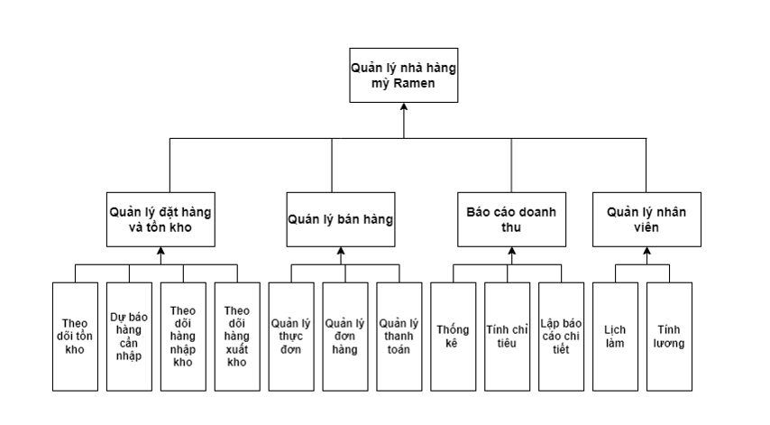
## 3.3 Ma trận thực thể dữ liệu – chức năng
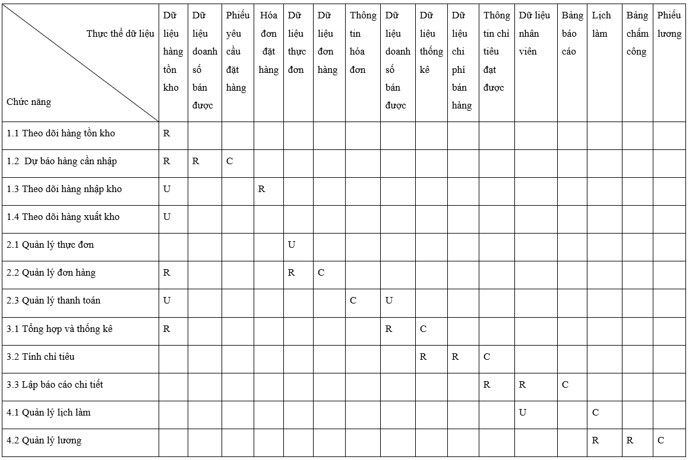
## 3.4 Sơ đồ luồng dữ liệu DFD (tới mức 2) – Soạn bằng phần mền Visual Diagram Enterprise
### 3.4.1 Sơ đồ luồng dữ liệu DFD ở mức ngữ cảnh (mức 0)
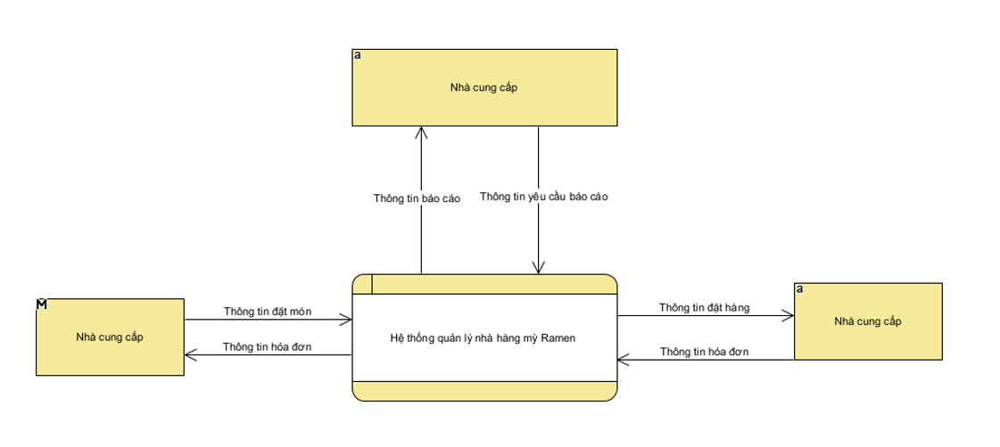

### 3.4.2 Sơ đồ luồng dữ liệu DFD ở mức ngữ đỉnh (mức 1) 
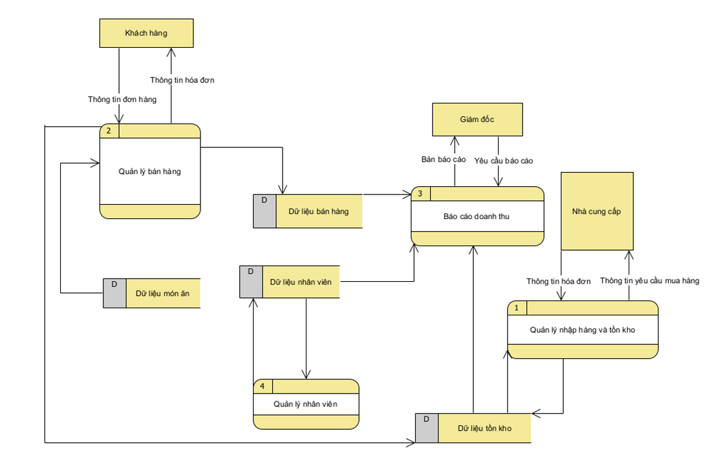

### 3.4.3 Các sơ đồ luồng dữ liệu DFD ở mức ngữ dưới đỉnh (mức 2)

### 3.4.3.1 Sơ đồ luồng dữ liệu DFD ở mức ngữ mức 2 của chức năng 1
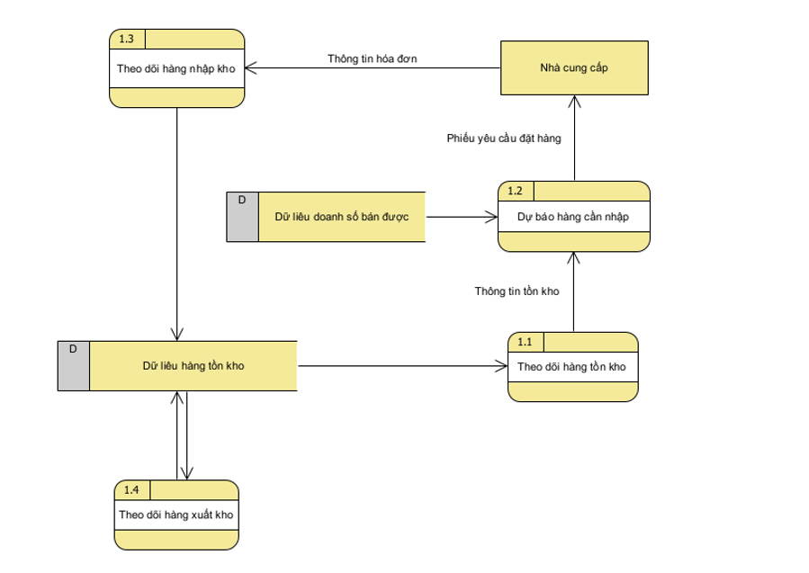
### 3.4.3.2 Sơ đồ luồng dữ liệu DFD ở mức ngữ mức 2 của chức năng 2
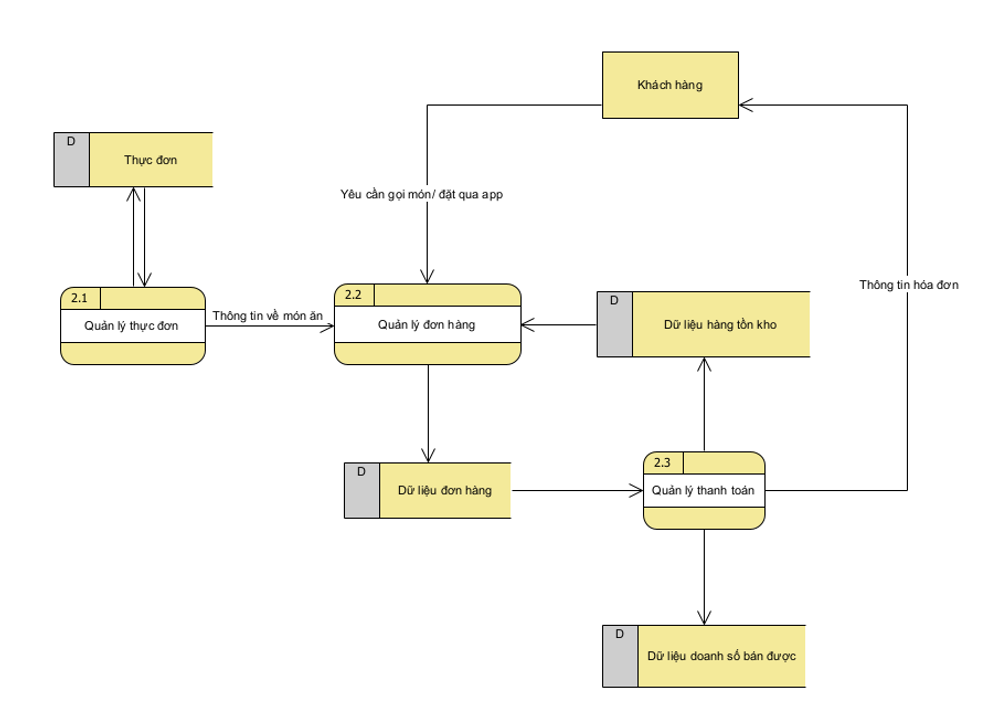

### 3.4.3.3 Sơ đồ luồng dữ liệu DFD ở mức ngữ mức 2 của chức năng 3
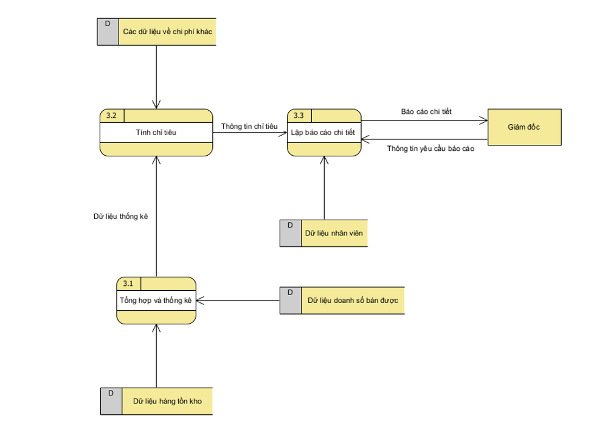

### 3.4.3.4 Sơ đồ luồng dữ liệu DFD ở mức ngữ mức 2 của chức năng 4
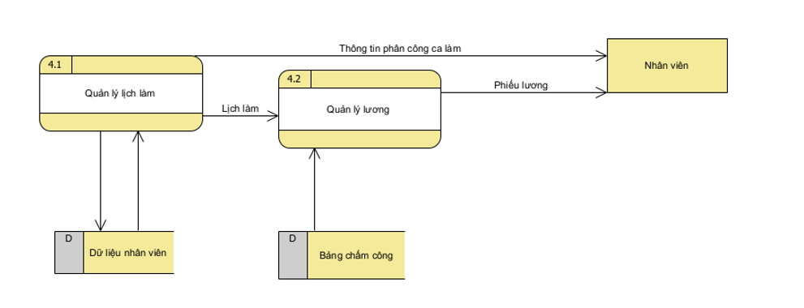

## 3.5 Mô tả các chức năng trong các sơ đồ luồng dữ liệu DFD ở mức cuối
### 3.5.1 Mô tả về các chức năng trong DFD mức 2 của chức năng 1
* Chức năng 1.1: Theo dõi hàng tồn kho
 + Tối mỗi ngày nhân viên ở bộ phận kho sẽ kiểm tra số lượng tồn thực tế, đối chiếu và nhập lên hệ thống thông tin.
 + Khi hàng tồn kho vượt dưới mức tối thiểu thì hệ thống sẽ cảnh báo.
* Chức năng 1.2: Dự báo hàng cần nhập
 + Dựa vào dữ liệu về doanh số bán được của tuần trước đó và thông tin hàng tồn kho thực tế hệ thống sẽ tự động tính toán số lượng hàng cần nhập để gửi cho quản lý xét duyệt.
 + Sau khi được quản lý duyệt, hệ thống sẽ tạo phiếu yêu cầu đặt hàng và gửi cho nhà cung cấp.
* Chức năng 1.3: Theo dõi hàng nhập kho
 + Sau khi đơn hàng được nhà cung cấp gửi đến kho, bộ phận vận chuyển của kho sẽ tiếp nhận hóa đơn gửi cho văn phòng kho xác nhận.
 + Khi đã xác nhận xong thì dữ liệu hàng tổn kho sẽ được cập nhật.
* Chức năng 1.4: Theo dõi hàng xuất kho
 + Mỗi tuần 2 lần, hàng từ bộ phận kho sẽ được gửi đến nhà hàng, ngay tại thời điểm đó một phiếu xuất kho sẽ được tạo ra.
 + Sau khi nguyên liệu làm món đã được gửi đến nhà hàng thì quản lý nhà hàng sẽ ký xác nhận và gửi chứng từ về lại văn phòng của bộ phận kho.
### 3.5.2 Mô tả về các chức năng trong DFD mức 2 của chức năng 2
* Chức năng 2.1: Quản lý thực đơn
 + Mỗi khi có đơn hàng được tạo ra, dữ liệu từ thực đơn sẽ được đọc ra để cung cấp thông tin về món ăn, nguyên liệu và giá bán.
 + Khi có món mỳ mới quản lý sẽ truy cập vào hệ thống để cập nhật thực đơn.
* Chức năng 2.2: Quản lý đơn hàng
 + Khi có khách gọi món/ đật món qua app, dữ liệu về đơn hàng sẽ được tạo ra.
 + Đơn hàng bao gồm mã đơn hàng, loại đơn hàng(Eat In, Take Away, Delivery), danh sách các món đã đặt, tổng tiền, mã nhân viên lập đơn hàng, số bàn(với đơn ăn tại chỗ) hoặc số hóa đơn(với đặt qua app).
 + Khi có khách đặt đơn hàng với số lượng lớn thì hệ thống sẽ tính toán số lượng nguyên liệu cần làm để kiểm tra nguyên liệu trong kho có đủ cung cấp hay không.
* Chức năng 2.3: Quản lý thanh toán
 + Khi khách ăn xong khách sẽ cầm hóa đơn ra quầy để thanh toán.
 + Đối với khách đặt qua app thì khách sẽ được chọn thanh toán bằng cách chuyển khoản ngay khi xác nhận đặt hàng, hoặc thanh toán sau khi shipper giao đồ ăn đến.
 + Sau khi đơn hàng đã được thanh toán xong thì dữ liệu doanh số bán được và dữ liệu hàng tồn kho ước tính sẽ được cập nhật.
### 3.5.3 Mô tả về các chức năng trong DFD mức 2 của chức năng 3
* Chức năng 3.1: Tổng hợp và thống kê
 + Cuối mỗi tháng quản lý sẽ truy cập vào hệ thống để tổng hợp doanh thu tháng đối chiếu với báo cáo hằng ngày của nhân viên để kiểm tra sai sót.
 + Bộ phận kho sẽ gửi dữ liệu về nguyên liệu đã sử dụng trong tháng qua cho quản lý nhà hàng.
* Chức năng 3.2: Tính chỉ tiêu
 + Hàng tháng các chứng từ về điện, nước, ga, mặt bằng, hóa đơn mua các vật tư của nhà hàng sẽ được gửi về văn phòng công ty X để xác nhận.
 + Sau khi tổng hợp và thống kê đủ doanh thu, số khách, chi phí quản lý sẽ sử dụng hệ thống để tính chỉ tiêu tháng này của nhà hàng.
* Chức năng 3.4: Lập báo cáo chi tiết
 + Mỗi tháng hoặc khi có vấn đề đặt biệt quan trọng giám đốc công ty X sẽ gửi yêu cầu báo cáo cho quản lý.
 + Quản lý sẽ báo cáo chỉ tiêu và đánh mức độ hoàn thành công việc của mỗi nhân viên để giám đốc nắm bắt được tình hình của nhà hàng.
### 3.5.4 Mô tả về các chức năng trong DFD mức 2 của chức năng 4
* Chức năng 4.1: Quản lý lịch làm
 + Dựa vào thời gian làm việc và dữ liệu năng lực của nhân viên quản lý sẽ sử dụng hệ thống để sắp xếp lịch làm của nhân viên và gửi vào cuối mỗi tuần.
 + Nếu nhân viên thay muốn thay đổi ca làm cố định thì quản lý sẽ truy cập vào hệ thống để thay đổi.
* Chức năng 4.2: Quản lý lương
 + Cuối tháng quản lý sẽ trích xuất bảng chấm công từ máy bấm vân tay của nhà hàng và đối chiếu với lịch làm của nhân viên sau đó gửi số giờ giàm lên văn phòng của công ty X.
 + Mùng 5 hằng tháng văn phòng sẽ gửi phiếu chi lương về nhà hàng để quản lý phát cho nhân viên hoặc gửi trực tiếp vào số tài khoản ngân hàng của nhân viên.

## 3.6 Mô hình thực thể - mối kết hợp ERD

### 3.6.1 Liệt kê tên và các thuộc tính của các thực thể
* Ca Làm:
 + Ngày phân công.
 + Mã số ca (Sáng: 1; Chiều: 2; Tối: 3).
* Nhân viên
 + Mã nhân viên.
 + Tên nhân viên.
 + Năm sinh.
 + Giới tính.
 + Số điện thoại.
 + Chức vụ.
 + Mức lương.
* Bàn
 + Mã số bàn(TLBNo - là số của bàn nếu là đơn ăn tại chỗ, ORDNo - là mã số hóa đơn nếu là đơn đặt qua Grab,ShopeeFood,BeFood,…)
 + Số ghế(là 0 nếu là đơn đặt qua app).
* Hóa Đơn:
 + Mã số hóa đơn.
 + Loại hóa đơn
 + Ngày lập hóa đơn.
 + Tổng tiền cần thanh toán.
* Món ăn:
 + Mã số món ăn.
 + Tên món ăn.
 + Giá món ăn.
* Nguyên liệu:
 + Mã nguyên liệu.
 + Tên nguyên liệu.
 + Số lượng tổn kho.
* Phiếu nhập kho:
 + Mã số của phiếu nhập kho.
 + Ngày lập.
 + Tên kho chứa.
* Nhà cung cấp:
 + Mã số nhà cung cấp.
 + Tên nhà cung cấp.
 + Địa chỉ nhà cung cấp.
 + Email nhà cung cấp.
### 3.6.2 Liệt kê tên và các thuộc tính (nếu có) của các mối kết hợp
* Nhân viên có trong ca:
 + Số giờ làm của nhân viên đó.
* Nhân viên lập hóa đơn.
* Bàn đã gọi món trong hóa đơn.
* Các món ăn có trong hóa đơn:
 + Số lượng các món.
 + Đơn giá từng món.
* Các nguyên liệu có trong món ăn:
 + Số lượng/ khối lượng từng loại nguyên liệu có trong món ăn.
* Các nguyên liệu thuộc phiếu nhập kho:
 + Số lượng trong lần nhập đó.
* Phiếu nhập kho thuộc nhà cung cấp.

### 3.6.3 Vẽ mô hình thực thể - mối kết hợp ERD – Soạn bằng trang [SmartDraw](https://www.smartdraw.com/)

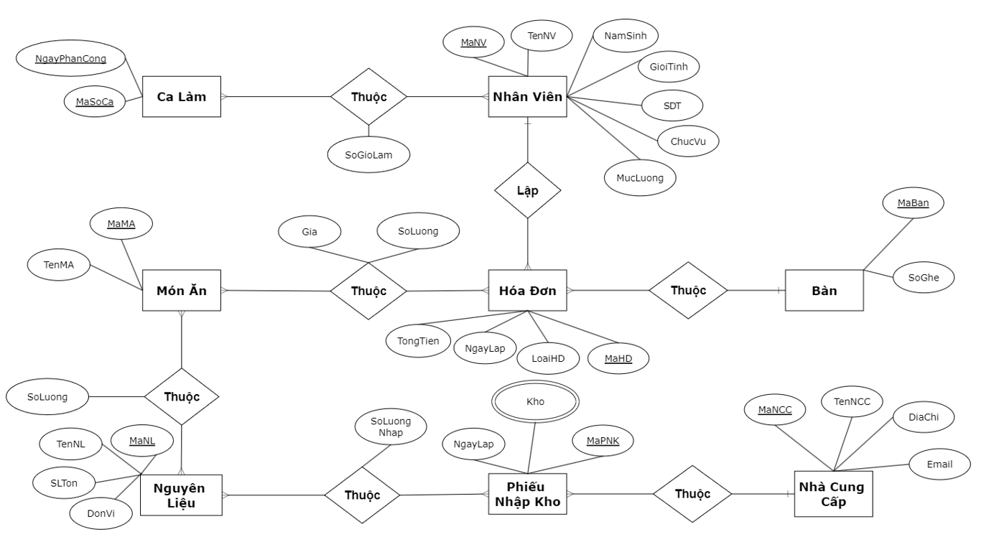

# Chương 4: Thiết kế hệ thống
## 4.1 Thiết kế dữ liệu: Chuyển từ mô hình thực thể - mối kết hợp (ERD) sang mô hình quan hệ (RD). 
Thiết kế các bảng, cột, khóa chính, khóa ngoại cho từng bảng trong mô hình quan hệ:
- NhanVien(MaNV,TenNV, NamSinh, GioiTinh, SDT, ChucVu) 
- CaLam(MaSoCa,NgayPhanCong) 
- Ban(MaBan, SoGhe) 
- HoaDon(MaHD, LoaiHD NgayLap, TongTien, #MaNV, #MaBan)
> Thuộc tính MaNV là khóa ngoại tham chiếu đếu thuộc tính MaNV của bảng NhanVien 
> Thuộc tính MaBan là khóa ngoại tham chiếu đếu thuộc tính MaBan của bảng Ban 
- MonAn(MaMA, TenMA, Gia) 
- NguyenLieu(MaNL, TenNL, SLTon, DonVi) 
- PhieuNhapKho(MaPNK, NgayLap, #MaNCC, #MaKho)
> Thuộc tính nhà MaNCC là khóa ngoại tham chiếu đến thuộc tính MaNCC của bảng NhaCungCap 
> Thuộc tính MaKho là khóa ngoại tham chiếu đến thuộc tính MaKho của bảng Kho 
- Kho(MaKho, TenKho,DiaChi)
- NhaCungCap(MaNCC, TenNCC, DiaChi, Email) 
- NhanVien_Thuoc_CaLam(#MaNV, #NgayPhanCong, #MaSoCa, SoGioLam)
> Thuộc tính MaNV vừa là khóa chính vừa là khóa ngoại tham chiếu đến thuộc tính MaNV của bảng NhanVien 
> Thuộc tính NgayPhanCong vừa là khóa chính vừa là khóa ngoại tham chiếu đến thuộc tính NgayPhanCong của bảng CaLam 
> Thuộc tính MaSoCa vừa là khóa chính vừa là khóa ngoại tham chiếu đến thuộc tính MaSoCa của bảng CaLam 
- ChiTietHoaDon (#MaHD, #MaMA,SoLuong, GiaMoiMon)
>Thuộc tính MaHD vừa là khóa chính vừa là khóa ngoại tham chiếu đến thuộc tính MaHD của bảng HoaDon 
>Thuộc tính MaMA vừa là khóa chính vừa là khóa ngoại tham chiếu đến thuộc tính MaMA của bảng MonAn 
- NguyenLieu_Trong_MonAn(#MaMA, #MaNL, SoLuong)
> Thuộc tính MaMA vừa là khóa chính vừa là khóa ngoại tham chiếu đến thuộc tính MaMA của bảng MonAn 
> Thuộc tính MaNL vừa là khóa chính vừa là khóa ngoại tham chiếu đến thuộc tính MaNL của bảng NguyenLieu 
- NguyenLieu_Thuoc_PhieuNhapKho(#MaNL, #MaPNK, SoLuongNhap)
> Thuộc tính MaNPNK vừa là khóa chính vừa là khóa ngoại tham chiếu đến thuộc tính MaPNK của bảng PhieuNhapKho 
> Thuộc tính MaNL vừa là khóa chính vừa là khóa ngoại tham chiếu đến thuộc tính MaNL của bảng NguyenLieu 

## 4.2 Thiết kế chương trình
### 4.2.1Thiết kế giao diện người dùng (GUI) (≥ 5 giao diện)
(Các giao diện dưới đây được minh họa bằng Microsoft Visual Studio 2022)

   

Giao diên đăng ký lịch làm
 

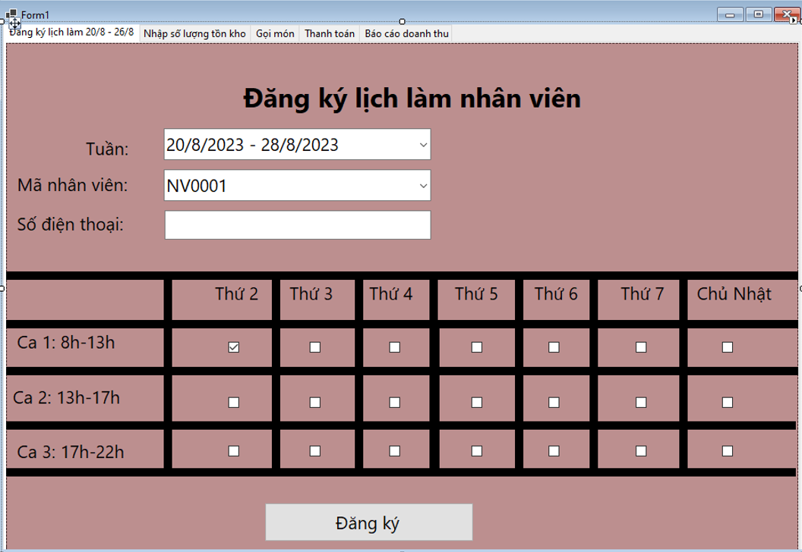

   

Giao diện báo cáo hàng tồn kho 
 

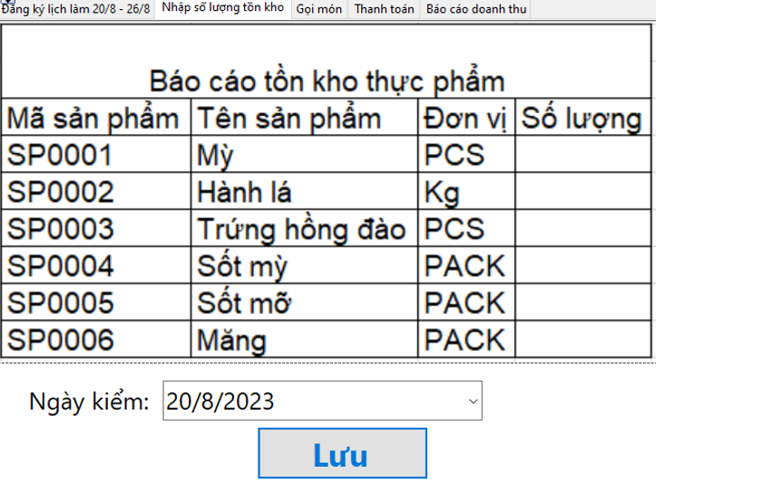

   

Giao diện tạo đơn hàng 
 

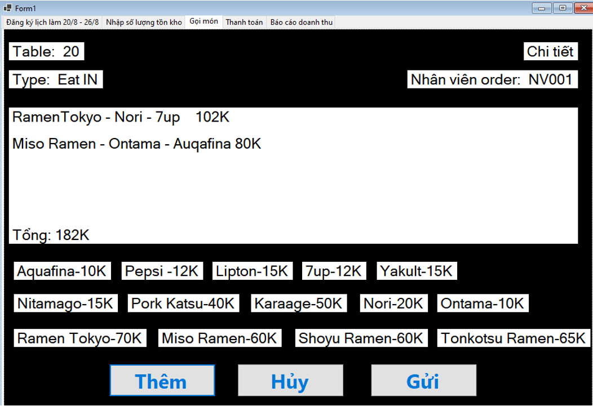

   

Giao diện thanh toán 
 

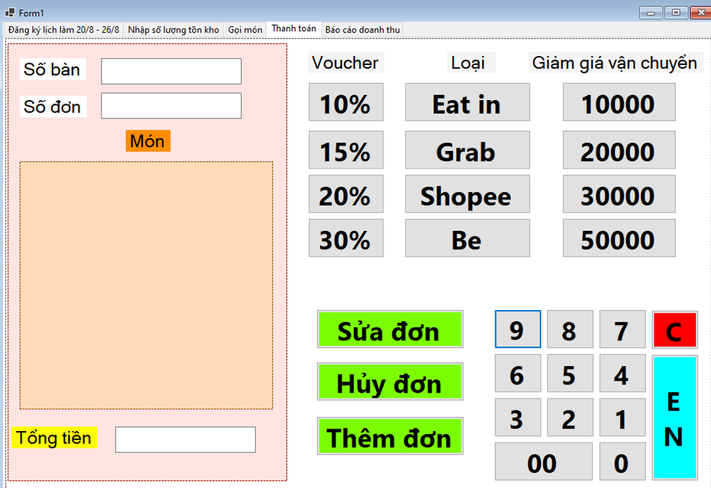

   

Giao diện báo cáo doanh thu
 

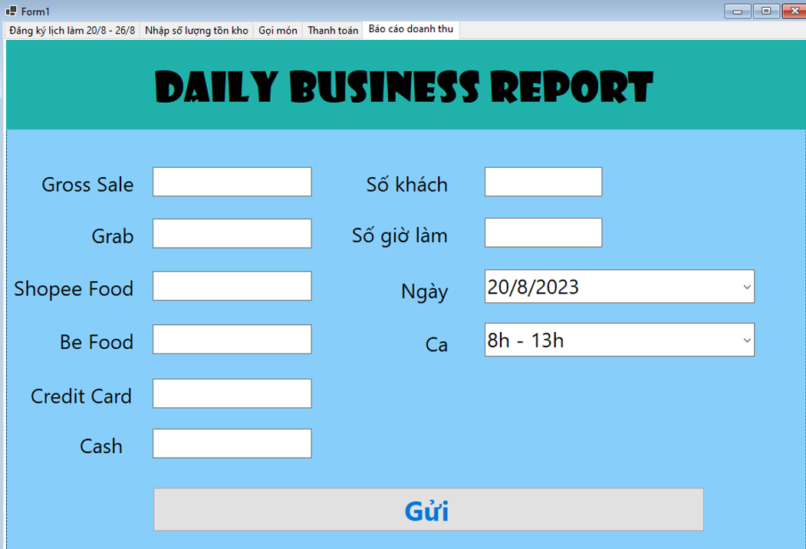

### 4.2.2Thiết kế các bảng in ra giấy (REPORT) (≥ 3 report)

   

Phiếu nhận hàng 
 
 
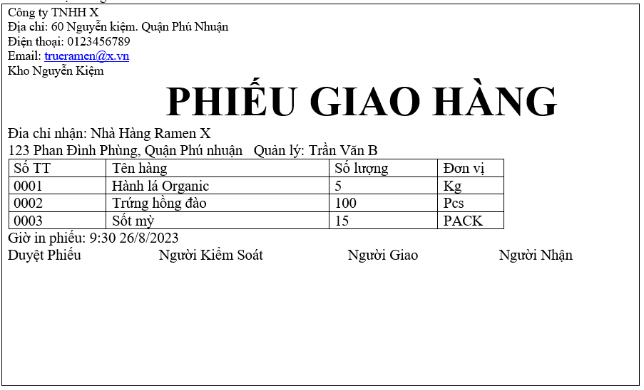

   

 Hóa đơn của khách hàng ăn tại chỗ 
 

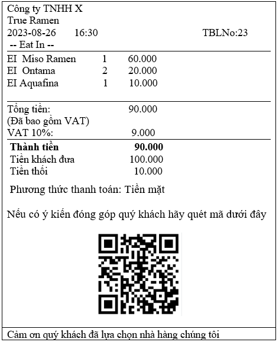

   

Hóa đơn của khách hàng đặt qua Grab 
 

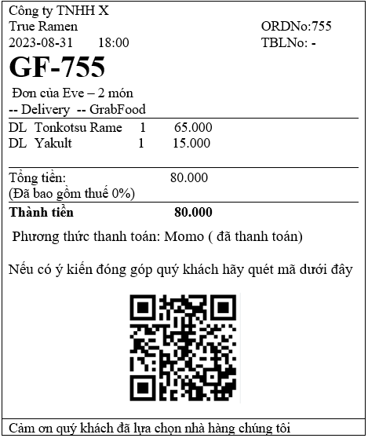

   

Giấy báo cáo doanh thu bán được mỗi ca 
 

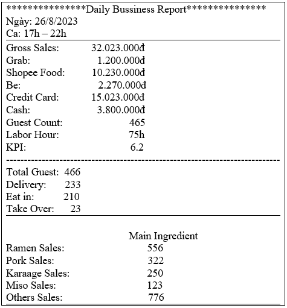

   

Giấy báo cáo tồn kho hằng ngày 
 

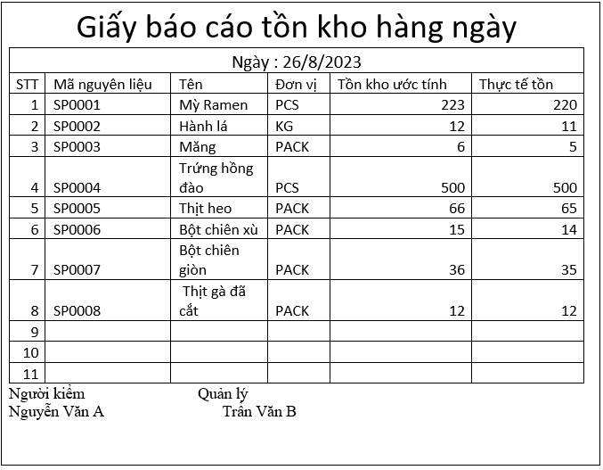

# Chương 5: Kết luận và tự đánh giá
Tự đánh giá về các ưu điểm của mình khi làm bài tập này
* Về kiến thức
 + Được giảng viên cung cấp đầy đủ kiến thức cũng như file mẫu để hoàn thành bài báo cáo tiểu luận một cách chỉnh chủ nhất.
 + Đã có kiến thức nền về cơ sở dữ liệu từ môn Nhập Môn Cơ Sở Dữ Liệu.
 + Có khả năng sử dụng các trang web, phần mềm soạn thảo để vẽ các biểu đồ. 
* Về kinh nghiệm
 + Được giảng viên dạy môn Cơ Sở Dữ Liệu thực hành trên cơ sở dữ liệu Northwind 
 + Từng làm các bài tập về cơ sở dữ 
 + Tự đánh giá về các nhược điểm của mình khi làm bài tập này
* Nêu các điểm con sai, lỗi chưa khắc phục được
 + Thực thể “Ca làm” được thiết kế chưa hợp lí. 
 + Bảng “Kho”  thiết kế chưa tối ưu.
* Nêu các nhận xét nhược điểm về kiến thức và kỹ năng của mình
 + Thiếu kinh nghiệm trong một hệ thống thông tin trong một doanh nghiệp thực tế nên nhiều chỗ còn mâu thuẫn.
 + Quản lý thời gian chưa hiệu quả dẫn đến phân chia thời gian không hợp lý để làm các phần của bài tiểu luận.
 + Ban đầu chưa định hình được hệ thống thông tin dẫn đến khá nhiều thời gian để vẽ các biểu đồ.

> Đề xuất chỉnh sửa:
 +CaLam: Thêm ThoiGianBatDau, ThoiGianKetThuc.
 +NhanVien_Thuoc_CaLam: Xóa NgayPhanCong, chỉ giữ MaNV, MaSoCa, SoGioLam.